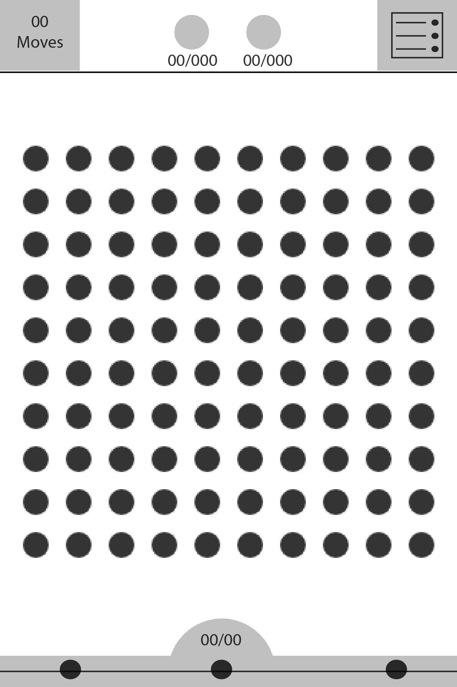

## Connect Dots

### Background

Connect Dots is a grid-like game in which the objective is to connect as many adjacent dots possible. Once the dots have been connected a new group of dots fill the empty spaces from top down.
Connecting the dots is possible through the user's mouse, the player looses when there are no more dots to connect.

### Functionality & MVP  

With this app, users will be able to:

- [ ] Connect dots with mouse movement

This project will include:

- [ ] A production Readme
- [ ] A Gif describing the rules of the game. (game play)

### Wireframes

This game will consist of a single screen with a gif popup explaining how the game works. The screen will then transition to the game with a Play button in the center. When the user connects the dots the score will appear on the screen along with a Play Again button and a mute button on the top right corner.

### Architecture and Technologies

This project will be implemented with the following technologies:

- Stage.js with HTML5 Canvas for DOM manipulation and rendering
- Vanilla JavaScript for overall structure and game logic

### Implementation Timeline

**Day 1**: Create the graphics and Background.

**Day 2**: Animate scene. Start developing the logic.

**Day 3**: Add responsiveness to mouse movement. Test.

**Day 4**: Continue testing and debugging. Create a gif with instructions.
